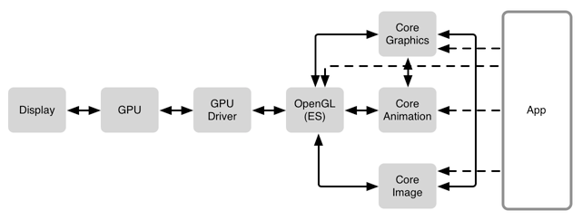
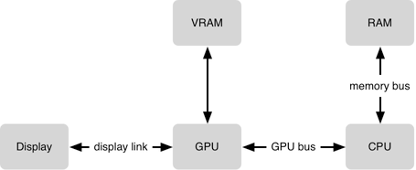

# iOS平台图像的渲染与缓存
## 1.引言
  一张图片是如何绘制到屏幕上去的？有很多种方式将一张图片映射到显示屏上，他们需要调用不同的框架、许多功能和方法的结合体。一个图片文件从网络上下载下来，经历几个过程最后变成一粒粒像素显示在屏幕上，在这过程中是否有可优化的点来缩短这个过程的时间。相对于超大尺寸图片的展示，它的内存和缓存如何处理？这篇文章循序渐进的带你了解渲染一张图片机器背后所做的事以及针对不同场景下图片的展示和内存缓存的处理。


## 2.图片显示原理及流程

当像素映射到屏幕上的时候，后台发生了很多事情。但一旦他们显示到屏幕上，每一个像素均由三个颜色组件构成：红，绿，蓝。三个独立的颜色单元会根据给定的颜色显示到一个像素上。在 iPhone5 的液晶显示器上有1,136×640=727,040个像素，因此有2,181,120个颜色单元。在15寸视网膜屏的 MacBook Pro 上，这一数字达到15.5百万以上。所有的图形堆栈一起工作以确保每次正确的显示。当你滚动整个屏幕的时候，数以百万计的颜色单元必须以每秒60次的速度刷新，这是一个很大的工作量。

#### 2.1将一张网络图片显示到手机屏幕的大体步骤
1.下载图片
2.图片处理（裁剪，边框等)
3.写入磁盘
4.从磁盘拷贝数据到内核缓冲区
5.从内核缓冲区复制数据到用户空间
6.生成UIImageView，把图像数据赋值给UIImageView
7.如果图像数据为未解码的PNG/JPG，解码为位图数据
8.CATransaction捕获到UIImageView layer树的变化
9.主线程Runloop提交CATransaction，开始进行图像渲染
9.1 如果数据没有字节对齐，Core Animation会再拷贝一份数据，进行字节对齐。
9.2 GPU处理位图数据，进行渲染。

#### 2.2软件部分所做的事

从简单的角度来看，软件流程看起来有点像这样：



Display 的上一层便是图形处理单元 GPU，GPU 是一个专门为图形高并发计算而量身定做的处理单元。这也是为什么它能同时更新所有的像素，并呈现到显示器上。它并发的本性让它能高效的将不同纹理合成起来。我们将有一小块内容来更详细的讨论图形合成。关键的是，GPU 是非常专业的，因此在某些工作上非常高效。比如，GPU 非常快，并且比 CPU 使用更少的电来完成工作。通常 CPU 都有一个普遍的目的，它可以做很多不同的事情，但是合成图像在 CPU 上却显得比较慢。

GPU Driver 是直接和 GPU 交流的代码块。不同的GPU是不同的性能怪兽，但是驱动使他们在下一个层级上显示的更为统一，典型的下一层级有 OpenGL/OpenGL ES.

OpenGL(Open Graphics Library) 是一个提供了 2D 和 3D 图形渲染的 API。GPU 是一块非常特殊的硬件，OpenGL 和 GPU 密切的工作以提高GPU的能力，并实现硬件加速渲染。对大多数人来说，OpenGL 看起来非常底层，但是当它在1992年第一次发布的时候(20多年前的事了)是第一个和图形硬件(GPU)交流的标准化方式，这是一个重大的飞跃，程序员不再需要为每个GPU重写他们的应用了。

OpenGL 之上扩展出很多东西。在 iOS 上，几乎所有的东西都是通过 Core Animation 绘制出来，然而在 OS X 上，绕过 Core Animation 直接使用 Core Graphics 绘制的情况并不少见。对于一些专门的应用，尤其是游戏，程序可能直接和 OpenGL/OpenGL ES 交流。事情变得使人更加困惑，因为 Core Animation 使用 Core Graphics 来做一些渲染。像 AVFoundation，Core Image 框架，和其他一些混合的入口。

要记住一件事情，GPU 是一个非常强大的图形硬件，并且在显示像素方面起着核心作用。它连接到 CPU。从硬件上讲两者之间存在某种类型的总线，并且有像 OpenGL，Core Animation 和 Core Graphics 这样的框架来在 GPU 和 CPU 之间精心安排数据的传输。为了将像素显示到屏幕上，一些处理将在 CPU 上进行。然后数据将会传送到 GPU，这也需要做一些相应的操作，最终像素显示到屏幕上。

这个过程的每一部分都有各自的挑战，并且许多时候需要做出折中的选择。

#### 2.3硬件部分所做的事



正如上面这张简单的图片显示那些挑战：GPU 需要将每一个 frame 的纹理(位图)合成在一起(一秒60次)。每一个纹理会占用 VRAM(video RAM)，所以需要给 GPU 同时保持纹理的数量做一个限制。GPU 在合成方面非常高效，但是某些合成任务却比其他更复杂，并且 GPU在 16.7ms(1/60s)内能做的工作也是有限的。

下一个挑战就是将数据传输到 GPU 上。为了让 GPU 访问数据，需要将数据从 RAM 移动到 VRAM 上。这就是提及到的上传数据到 GPU。这看起来貌似微不足道，但是一些大型的纹理却会非常耗时。

最终，CPU 开始运行你的程序。你可能会让 CPU 从 bundle 加载一张 PNG 的图片并且解压它。这所有的事情都在 CPU 上进行。然后当你需要显示解压缩后的图片时，它需要以某种方式上传到 GPU。一些看似平凡的，比如显示文本，对 CPU 来说却是一件非常复杂的事情，这会促使 Core Text 和 Core Graphics 框架更紧密的集成来根据文本生成一个位图。一旦准备好，它将会被作为一个纹理上传到 GPU 并准备显示出来。当你滚动或者在屏幕上移动文本时，不管怎么样，同样的纹理能够被复用，CPU 只需简单的告诉 GPU 新的位置就行了,所以 GPU 就可以重用存在的纹理了。CPU 并不需要重新渲染文本，并且位图也不需要重新上传到 GPU。


## 3.可以在在哪个地方提升速度

1. 异步下载图片
2. image解压缩放到子线程
3. 使用缓存 (包括内存级别和磁盘级别)
存储解压缩后的图片，避免下次从磁盘加载的时候再次解压缩
4. 使用mmap内存映射，省去了上述第4步数据从内核空间拷贝到用户空间的操作。
5. 缓存解码后的位图数据到磁盘，下次从磁盘读取时省去第7步解码的操作。
6. 生成字节对齐的数据，防止上述第9.1步CoreAnimation在渲染时再拷贝一份数据。

#### 3.1 异步下载图片
imageView对象和图片的url相关联，在滑动时，不取消旧的下载任务，而是在下载任务完成回调时，进行url匹配，只有匹配成功的image会刷新imageView对象，而其他的image则只做缓存操作，而不刷新UI。

同时，仍然管理一个执行队列，为了避免占用太多的资源，通常会对执行队列设置一个最大的并发量。此外，为了保证LIFO的下载策略，可以自己维持一个等待队列，每次下载任务开始的时候，将后进入的下载任务插入到等待队列的前面。

#### 3.2 通用的解压缩方案
主体的思路是在子线程，将原始的图片渲染成一张的新的可以字节显示的图片，来获取一个解压缩过的图片。
基本上比较流行的一些开源库都先后支持了在异步线程完成图片的解压缩，并对解压缩过后的图片进行缓存。

下面的代码是SDWebImage的解决方案:

```
+ (UIImage *)decodedImageWithImage:(UIImage *)image {
    if (image.images) {
        // Do not decode animated images
        return image;
    }

    CGImageRef imageRef = image.CGImage;
    CGSize imageSize = CGSizeMake(CGImageGetWidth(imageRef), CGImageGetHeight(imageRef));
    CGRect imageRect = (CGRect){.origin = CGPointZero, .size = imageSize};

    CGColorSpaceRef colorSpace = CGColorSpaceCreateDeviceRGB();
    CGBitmapInfo bitmapInfo = CGImageGetBitmapInfo(imageRef);

    int infoMask = (bitmapInfo & kCGBitmapAlphaInfoMask);
    BOOL anyNonAlpha = (infoMask == kCGImageAlphaNone ||
            infoMask == kCGImageAlphaNoneSkipFirst ||
            infoMask == kCGImageAlphaNoneSkipLast);

    // CGBitmapContextCreate doesn't support kCGImageAlphaNone with RGB.
    // https://developer.apple.com/library/mac/#qa/qa1037/_index.html
    if (infoMask == kCGImageAlphaNone && CGColorSpaceGetNumberOfComponents(colorSpace) > 1) {
        // Unset the old alpha info.
        bitmapInfo &= ~kCGBitmapAlphaInfoMask;

        // Set noneSkipFirst.
        bitmapInfo |= kCGImageAlphaNoneSkipFirst;
    }
            // Some PNGs tell us they have alpha but only 3 components. Odd.
    else if (!anyNonAlpha && CGColorSpaceGetNumberOfComponents(colorSpace) == 3) {
        // Unset the old alpha info.
        bitmapInfo &= ~kCGBitmapAlphaInfoMask;
        bitmapInfo |= kCGImageAlphaPremultipliedFirst;
    }

    // It calculates the bytes-per-row based on the bitsPerComponent and width arguments.
    CGContextRef context = CGBitmapContextCreate(NULL,
            imageSize.width,
            imageSize.height,
            CGImageGetBitsPerComponent(imageRef),
            0,
            colorSpace,
            bitmapInfo);
    CGColorSpaceRelease(colorSpace);

    // If failed, return undecompressed image
    if (!context) return image;

    CGContextDrawImage(context, imageRect, imageRef);
    CGImageRef decompressedImageRef = CGBitmapContextCreateImage(context);

    CGContextRelease(context);

    UIImage *decompressedImage = [UIImage imageWithCGImage:decompressedImageRef scale:image.scale orientation:image.imageOrientation];
    CGImageRelease(decompressedImageRef);
    return decompressedImage;
}
```

#### 3.3 使用缓存
* 内存缓存 内存层面的相当是个缓存器，以Key-Value的形式存储图片。当内存警告的时候会清除所有缓存图片。如有一个类似商品浏览的页面的话，可以在页面销毁后同时清理内存
* 磁盘缓存 可设置一个最大缓存size当磁盘缓存超过最大size后清理比较老的图片

#### 3.4 内存映射
 平常我们读取磁盘上的一个文件，上层API调用到最后会使用系统方法read()读取数据，内核把磁盘数据读入内核缓冲区，用户再从内核缓冲区读取数据复制到用户内存空间，这里有一次内存拷贝的时间消耗，并且读取后整个文件数据就已经存在于用户内存中，占用了进程的内存空间。 FastImageCache采用了另一种读写文件的方法，就是用mmap把文件映射到用户空间里的虚拟内存，文件中的位置在虚拟内存中有了对应的地址，可以像操作内存一样操作这个文件，相当于已经把整个文件放入内存，但在真正使用到这些数据前却不会消耗物理内存，也不会有读写磁盘的操作，只有真正使用这些数据时，也就是图像准备渲染在屏幕上时，虚拟内存管理系统VMS才根据缺页加载的机制从磁盘加载对应的数据块到物理内存，再进行渲染。这样的文件读写文件方式少了数据从内核缓存到用户空间的拷贝，效率很高。

#### 3.5 解码图像
 一般我们使用的图像是JPG/PNG，这些图像数据不是位图，而是是经过编码压缩后的数据，使用它渲染到屏幕之前需要进行解码转成位图数据，这个解码操作是比较耗时的，并且没有GPU硬解码，只能通过CPU，iOS默认会在主线程对图像进行解码。很多库都解决了图像解码的问题，不过由于解码后的图像太大，一般不会缓存到磁盘，SDWebImage的做法是把解码操作从主线程移到子线程，让耗时的解码操作不占用主线程的时间。 FastImageCache也是在子线程解码图像，不同的是它会缓存解码后的图像到磁盘。因为解码后的图像体积很大，FastImageCache对这些图像数据做了系列缓存管理，详见下文实现部分。另外缓存的图像体积大也是使用内存映射读取文件的原因，小文件使用内存映射无优势，内存拷贝的量少，拷贝后占用用户内存也不高，文件越大内存映射优势越大。 字节对齐 Core Animation在图像数据非字节对齐的情况下渲染前会先拷贝一份图像数据，官方文档没有对这次拷贝行为作说明，模拟器和Instrument里有高亮显示“copied images”的功能，但似乎它有bug，即使某张图片没有被高亮显示出渲染时被copy，从调用堆栈上也还是能看到调用了CA::Render::copy_image方法： fastImageCache1 
 

#### 3.6 字节对齐 
按我的理解，为了性能，底层渲染图像时不是一个像素一个像素渲染，而是一块一块渲染，数据是一块块地取，就可能遇到这一块连续的内存数据里结尾的数据不是图像的内容，是内存里其他的数据，可能越界读取导致一些奇怪的东西混入，所以在渲染之前CoreAnimation要把数据拷贝一份进行处理，确保每一块都是图像数据，对于不足一块的数据置空。大致图示：(pixel是图像像素数据，data是内存里其他数据) fastImageCache2块的大小应该是跟CPU cache line有关，ARMv7是32byte，A9是64byte，在A9下CoreAnimation应该是按64byte作为一块数据去读取和渲染，让图像数据对齐64byte就可以避免CoreAnimation再拷贝一份数据进行修补。FastImageCache做的字节对齐就是这个事情。

## 4.针对项目中大量小图显示
大量小图显示指的也是多图下载。以UITableView为例，我们在很多项目中会遇到UITableView需要去显示一些标题、详情、图片等内容。我们需要去加载图片显示，有时候我们会为书写简单选择这种思路。

```
cell.textLabel.text = app.name;
cell.detailTextLabel.text = app.download;NSData *imageData = [NSData dataWithContentsOfURL:app.url];
cell.imageView.image = [UIImage imageWithData:imageData];
```

*这样写有什么后果呢?

* 1.不可避免的卡顿(因为没有异步下载操作)
* 2.dataWithContentsOfURL：是耗时操作，将其放在主线程会造成卡顿。如果图片很多、很大，并且网络情况不好的话肯定会卡.
* 3.同一图片重复下载，耗费流量和系统开销(因为没有建立缓存机制)由于没有缓存机制，即使下载完成并显示了当前cell的图片，但是当该cell再一次需要显示的时候还是会下载它所对应的图片：耗费了下载流量，而且还导致重复操作。

*怎么可以避免这些问题呢？
1.解决方案流程图

注：该流程图所需要的数据源：

* 1. 图片的URL：因为每张图片对应的URL都是唯一的，所以我们可以通过它来建立图片缓存和下载操作的缓存的键，以及拼接沙盒缓存的路径字符串。
* 2. 图片缓存(字典)：存放于内存中;键为图片的URL，值为UIImage对象。作用：读取速度快，直接使用UIImage对象。
* 3. 下载操作缓存(字典)：存放与内存中，键为图片的URL，值为NSBlockOperation对象。作用：用来避免对于同一张图片还要开启多个下载线程。
* 4. 沙盒缓存(文件路径对应NSData)：存放于磁盘中，位于Cache文件夹内。值为NSData对象(将UIImage转化为NSData才能写入磁盘里)。作用：程序断网，再次启动也可以直接在磁盘中拿到图片。

*异步+缓存管理图片的相关实现代码

```
//图片缓存，下载操作缓存，沙盒缓存路径
　　/**
　　* 存放所有下载完的图片
　　*/@property (nonatomic, strong) NSMutableDictionary *images;/**
　　* 存放所有的下载操作(key是url，value是operation对象)
　　*/@property (nonatomic, strong) NSMutableDictionary *operations;/**
　　* 拼接Cache文件夹的路径与url最后的部分，合并成唯一约定好的缓存路径
　　*/#define CachedImageFile(url) [[NSSearchPathForDirectoriesInDomains(NSCachesDirectory, NSUserDomainMask, YES) lastObject] stringByAppendingPathComponent:[url lastPathComponent]]
```

```

//图片下载之前的查询缓存部分：
　　//先从images缓存中取出图片url对应的UIImage
　　UIImage *image = self.images[app.icon]; if (image) { //存在：说明图片已经下载成功，并缓存成功)
　　cell.imageView.image = image;
　　} else { // 不存在：说明图片并未下载成功过，或者成功下载但是在images里缓存失败，需要在沙盒里寻找对于的图片
　　// 获得url对于的沙盒缓存路径
　　NSString *file = CachedImageFile(app.icon); // 先从沙盒中取出图片
　　NSData *data = [NSData dataWithContentsOfFile:file]; if (data) { //data不为空，说明沙盒中存在这个文件
　　cell.imageView.image = [UIImage imageWithData:data];
　　} else {// 反之沙盒中不存在这个文件
　　// 在下载之前显示占位图片
　　cell.imageView.image = [UIImage imageNamed:@"placeholder"];// 下载图片
　　[self download:app.icon indexPath:indexPath];
　　}
　　}
```
```
// 图片的下载部分：
　　/**
　　* 下载图片
　　* @param imageUrl 图片的url
　　*/- (void)download:(NSString *)imageUrl indexPath:(NSIndexPath *)indexPath
　　{ // 取出当前图片url对应的下载操作(operation对象)
　　NSBlockOperation *operation = self.operations[imageUrl]; if (operation) return; // 创建操作，下载图片
　　__weak typeof(self) appsVc = self;
　　operation = [NSBlockOperation blockOperationWithBlock:^{ NSURL *url = [NSURL URLWithString:imageUrl]; NSData *data = [NSData dataWithContentsOfURL:url];// 下载
　　UIImage *image = [UIImage imageWithData:data]; // NSData -> UIImage
　　// 回到主线程
　　[[NSOperationQueue mainQueue] addOperationWithBlock:^{ if (image) { // 如果存在图片(下载完成)，存放图片到图片缓存字典 中
　　appsVc.images[imageUrl] = image; //将图片存入沙盒中
　　//1. 先将图片转化为NSData
　　NSData *data = UIImagePNGRepresentation (image); //2. 再生成缓存路径
　　[data writeToFile:CachedImageFile(imageUrl) atomically:YES];
　　} // 从字典中移除下载操作 (保证下载失败后， 能重新下载)
　　[appsVc.operations removeObjectForKey:imageUrl]; // 刷新当前表格，减少系统开销
　　[appsVc.tableView reloadRowsAtIndexPaths:@ [indexPath] withRowAnimation:UITableViewRowAnimationNone];
　　}];
　　}]; // 添加下载操作到队列中
　　[self.queue addOperation:operation]; // 将当前下载操作添加到下载操作缓存中 (为了解决重复下载)
　　self.operations[imageUrl] = operation;
　　}
```
*需要注意的部分
1.关于图片缓存：
下载成功，拿到了图片，就将图片添加到图片缓存中;下载失败，什么都不做（反正此时也没有图片）。在这种机制下，就没有删除缓存里某个图片项的情况，因为图片缓存永远不会出现重复添加多个相同图片的情况，缓存中只要有一张对应的图，就直接拿去用了，不会再去加载。
2.关于沙盒缓存：
同样地，对于沙盒缓存也是一个道理：有图就将其转化为NSData，写入磁盘，并对应唯一的路径，没有图就不写。所以即使是要下载相同的图片，因为当前url对应的沙盒路径已经存在文件了，所以直接拿就可以了，不会再下载。
3.关于下载操作缓存
我们需要在下载回调完成后，立即将当前的下载操作从下载操作缓存中删去（为了要避免下载失败后，无法再次下载的情况的发生）。由于将下载操作加入到下载操作缓存的时机是在下载开始的那一刻而不是下载成功的那一刻。如果在下载开始的那一刻加入到缓存中的话，这个缓存信息就包括两个情况：下载成功和下载失败：下载成功也就有相应的图片缓存和沙盒缓存，假如下载失败了，那就肯定不会有对应的图片缓存和沙盒缓存，也就肯定会来到判断当前的下载操作是否在下载操作缓存里这一步。因为没有被删去，它是存在的。导致曾经下载失败的图片永远不会再次下载。

## 5.针对超大尺寸图片的显示

当从线上下载一张图片下来后，图片的分辨率可能很大，如果直接给UIImage加载的话，有可能会因OOM导致程序crash，所以在图片下下来之后判断它的分辨率是否大于一个阈值，大于的话就对它进行裁剪，IOS提供有有图片裁剪的API，

UIGraphicsBeginImageContextWithOptions(zoomedSize, false, 1);

zoomedSize表示要裁剪的图片分辨率大小

[self drawInRect:CGRectMake(0,0, zoomedSize.width, zoomedSize.height)];

UIImage *newImage =UIGraphicsGetImageFromCurrentImageContext();

UIGraphicsEndImageContext();

newImage就是裁剪后的图片image，裁剪后再把image保存到文件中。

当我们在某一个View 多个UIImageView，且UIImageView都显示的是高清大图，就有可能出现内存警告的问题。如果第一次进入这个view，没有发生内存警告，当再次进入这个view，如果上一次的内存没有及时释放，这一次次的累加，便可导致内存崩溃。

UIImage 加载图片的方式：

 [UIImage imageNamed:nil]：使用这种方式加载，系统会对加载的图片缓存起来，只要程序不退出，它便一直在内存中，所以第二次加载的时候会比较快。

[UIImageimageWithContentsOfFile:path]：从文件中加载图片，用完后可以释放掉。

上面第一种方式适合加载本地的小的资源图片，比如icon之类的，第二种方式适合加载分辨率较大的图片，假如当前有A、B、C、D、E这几张大图，在浏览C图片的时候，为了让用户感觉不到图片的加载，会同时预先加载它的前一张图片B和后一张图片D，当滑动到C的前一张B时，先将D及时释放掉，再预先加载A，以此类推，这样在浏览具有多张大图的时候，系统中同一时刻只需保存三张加载的图片，而不必每一张都加载进来而造成OOM。

这样虽然解决了浏览多张大图时的内存问题，但是每次加载大图，界面会造成卡顿，一种策略就是用多线程的方式让图片显示不会影响到主线程的响应。但是多线程加载就会遇到UIImage对图片加载的特殊处理问题。在后台线程中用UIImage加载图片时，其实并不是在真正的加载图片，它只是引用到原始的图片数据块，并不会对图片进行解码然后加载，只有到图片真正要显示的时候。 而界面的显示刷新都是由主线程负责的。 这意味着图片真正影响性能的解码工作又回到了主线程了。 这样加后台线程就没有达到我们预期的效果。 这个时候可能需要用到一些办法强制后台线程进行数据解码工作，IOS提供了底层的API可以对加载的UIImage进行解码，

CGContextRef context = CGBitmapContextCreate()，当调用这个函数的时候，Quartz创建一个位图绘制环境，也就是位图上下文。当你向上下文中绘制信息时，Quartz把你要绘制的信息作为位图数据绘制到指定的内存块。一个新的位图上下文的像素格式由三个参数决定：每个组件的位数，颜色空间，alpha选项。然后调用CGContextDrawImage()将UIImage画到刚创建的位图区域中，此时这个位图区域是已经解码后的位图数据，是可以直接交给GPU渲染的，最后再调用

CGImageRef drawnImage = CGBitmapContextCreateImage()拿到这个位图区域的指针，经过[UIImage imageWithCGImage:drawnImage]转换后就得到了UIImage对象，可以直接交给主线程中的UIImageView进行显示了。

## 6.总结

通过以上的分析总结，保存位图到磁盘使用mmap内存映射是可以大大提高载入图片的效率，但是有个弊端会比平常图片的体积大15倍左右。

* 对于小中图使用mmap内存映射来提升在tableview显示速度。
* 对于超大尺寸的显示，在展示大尺寸图片前先将图片尺寸缩放到内存可以接受的大小然后通过`[UIImage imageWithContentsOfFile:path]`从磁盘异步加载出来并将内存及时释放掉。

